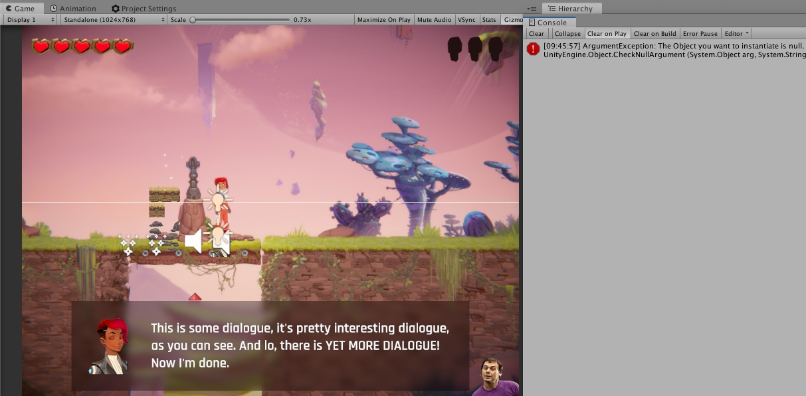

# Giacomelli.Unity.ToastyNotification
A fun editor log interceptor that play Mortal Kombat's Toasty easter-egg every time an error is logged

*[Watch the full sample on YouTube](https://youtu.be/wwhz2wPN_wU)*

# Setup
Just install the `ToastyNotification.package` on the [release page](https://github.com/giacomelli/Giacomelli.Unity.ToastyNotification/releases).

Now every time your game raise an error on Unity's editor console log, the Toasty Notifcation will warning you :wink:!

## How to improve it?

Create a fork of [Giacomelli.Unity.ToastyNotification](https://github.com/giacomelli/Giacomelli.Unity.ToastyNotificationfork). 

Did you change it? [Submit a pull request](https://github.com/giacomelli/Giacomelli.Unity.ToastyNotificationpull/new/master).

## License
Licensed under the The [MIT License (MIT)](LICENSE).
In others words, you can use this library for developement any kind of software: open source, commercial, proprietary, etc.